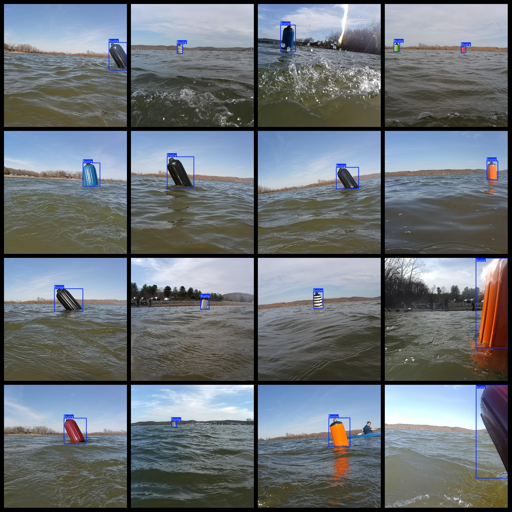
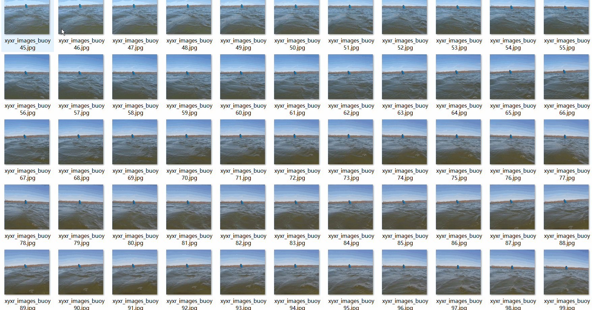

# Water in Buoy Detection Dataset 14056 imagesVOC+YOLO format

This dataset consists of 14056 images in the format of VOC+YOLO.

Dataset format: Pascal VOC format + YOLO format (the txt file does not contain the split path, it only contains jpg images and corresponding VOC format xml files and yolo format txt files)

The number of jpg files: 14056

Number of xml files: 14056

Number of files (txt): 14,056

Number of categories: 1

The Github repository is: datasets_sl

["buoy"]

Number of boxes labeled in each category:

The English translation is:
"buoy number = 16407"

Total frame count: 16407

Number of images per category:

Buoy possession count = 14056

Image resolution: 640x640

Use the labeling tool: labelImg

Dataset Augmentation: Yes

Rules for annotation: Draw a rectangle around the category.

Important Note: The dataset is not divided into training, validation, or testing sets; you should manually create your own. (The images were created by stitching multiple water body video screenshots together.)

Special Disclaimer: This dataset does not guarantee the accuracy of the trained models or weight files.

Annotation and image details are as follows:

## Images

---

Here is a pay link on Stripe (https://buy.stripe.com/3cs8yP7sY87d0vu9AB). Please contact me lonlonago@foxmail.com after funding $89, and I will send you a complete data files, thank you!

